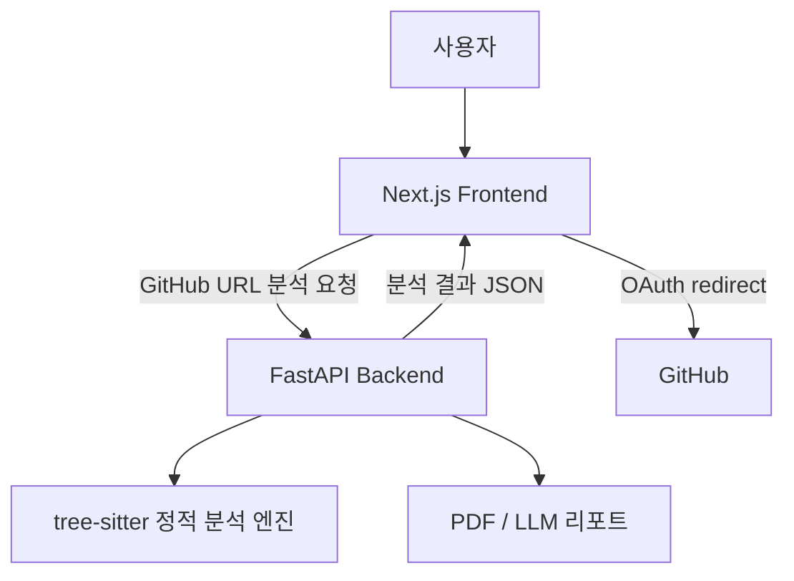

# DoUSECURE Frontend

[](https://github.com/Capstone-P17/frontend/actions/workflows/frontend-ci.yml)

DoUSECURE Frontend는 GitHub 저장소 URL을 입력해 소스코드 취약점 분석을 요청하고, 백엔드가 반환한 탐지 결과를 대시보드와 상세 화면으로 보여주는 Next.js 웹 애플리케이션입니다.


## 주요 화면

- 홈: GitHub 저장소 URL 입력과 샘플 분석 진입
- 로딩: 분석 진행 상태와 공식 샘플 기준 탐지 범위 안내
- 대시보드: 분석 요약, 취약점 분포, 영향 파일, 취약점 목록
- 상세 분석: 취약 코드, 권장 수정 예시, 탐지 근거, 신뢰도 판단 기준, 공식 가이드 매핑

## 기술 스택

- Next.js 15
- React
- TypeScript
- Tailwind CSS
- shadcn/ui
- pnpm

## 빠른 실행

```bash
pnpm install
pnpm dev
```

기본 실행 주소:

- Frontend: `http://localhost:3000`
- Backend: `http://localhost:8000`

## 환경 변수

`.env.example`을 참고해 `.env.local`을 만든다.

```env
NEXT_PUBLIC_BACKEND_BASE_URL=http://localhost:8000
```

GitHub OAuth 로그인을 함께 확인하려면 백엔드의 OAuth 환경 변수도 설정되어 있어야 한다.

## 백엔드 연동

프론트엔드는 다음 백엔드 API를 사용한다.

- `/capabilities`: 지원 detector와 공식 가이드 매핑 정보
- `/auth/github`, `/auth/me`, `/auth/logout`: GitHub OAuth BFF 인증 흐름
- `/analyze/repository/jobs`: 저장소 분석 작업 생성
- `/analyze/jobs/{job_id}`: 분석 작업 상태 조회
- `/result/{analysis_id}`: 분석 결과 조회
- `/report/{analysis_id}`: PDF 리포트 다운로드

상세 API 문서는 백엔드 실행 후 `http://localhost:8000/docs`에서 확인할 수 있다.

## 아키텍처



## 검증 명령어

```bash
pnpm lint
pnpm typecheck
pnpm test
pnpm build
```

## 팀 역할

- UI/UX 화면 설계와 분석 결과 시각화
- 백엔드 API 연동과 인증 상태 처리
- 대시보드/상세 분석 화면의 취약점 근거 표시
- 공식 가이드 기준 문구와 지원 범위 안내
